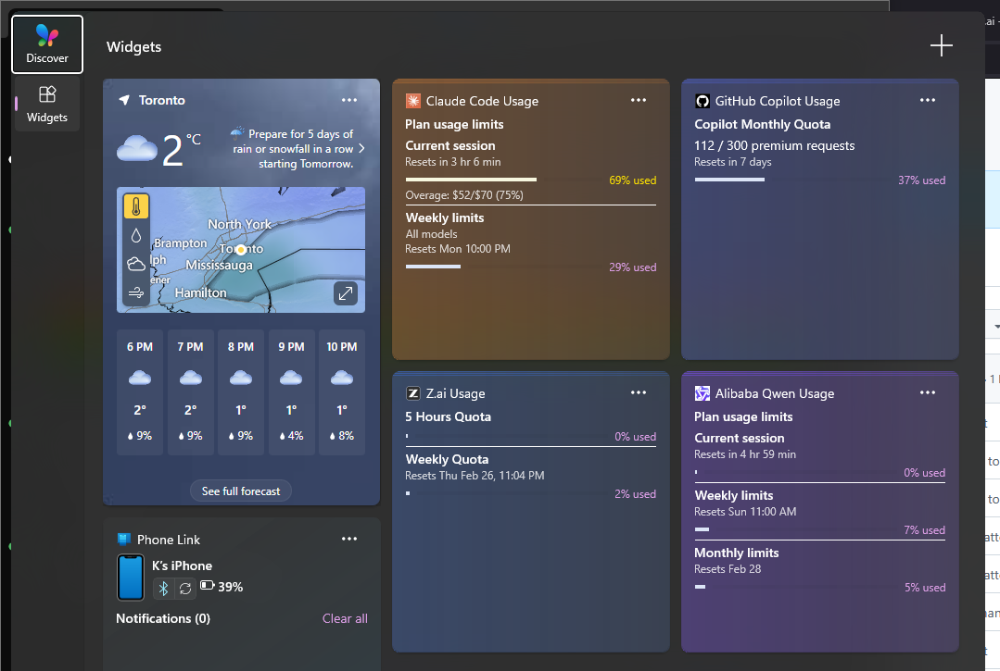

# Token Budget

A Windows 11 Widgets Board widget that tracks your LLM usage quotas at a glance — no browser tabs, no digging through dashboards.



## What it shows

Four widgets, one per service:

| Widget | Tracks |
|--------|--------|
| **Claude Code Usage** | 5-hour rolling token budget + weekly limits (Pro/Max plans) |
| **Z.ai Usage** | 5-hour quota + weekly quota (GLM via opencode CLI) |
| **GitHub Copilot Usage** | Monthly premium request count (300/month on Pro) |
| **Alibaba Qwen Usage** | 5-hour, weekly, and monthly request quotas |

Each widget shows a progress bar, reset time, and usage percentage. The bar turns yellow near the limit and red when you're at or over it.

## Requirements

- Windows 11
- Developer Mode enabled: **Settings → Privacy & Security → For developers → Developer Mode: On**

## Installation

1. Download the latest `.msix` from [Releases](../../releases)
2. Double-click to install (Windows will prompt to trust the package)
3. Press **Win+W** to open the Widgets board
4. Click **+** and search for "Claude", "Z.ai", "Copilot", or "Qwen"
5. Add whichever widgets you want

## Provider setup

### Claude Code

No setup needed. The widget reads your local Claude Code session files automatically.

To see **plan usage limits** (the 5-hour quota bar), you need to be signed in to Claude Code with a Pro or Max subscription. The widget picks up your credentials automatically.

### Z.ai (opencode CLI)

No setup needed if you use [opencode](https://opencode.ai/). The widget reads your local session files and fetches quota info from the Z.ai API using the credentials opencode already saved.

### GitHub Copilot

Requires [GitHub CLI](https://cli.github.com/) installed and authenticated:

```powershell
gh auth login
gh auth refresh -s user
```

The widget uses `gh auth token` to read your credentials — no manual token entry needed.

### Alibaba Qwen Code

No setup needed. The widget reads your local Qwen Code session files and estimates quota usage client-side (no Alibaba API required).

## FAQ

**Why does the widget show stale data after I close the Widgets board?**
Widgets only update while the board is open. Open Win+W to refresh.

**The widget disappeared / stopped working after a Windows update.**
Reinstall the `.msix` package.

**Can I add multiple copies of the same widget?**
No, each widget is unique per service.

## License

MIT
