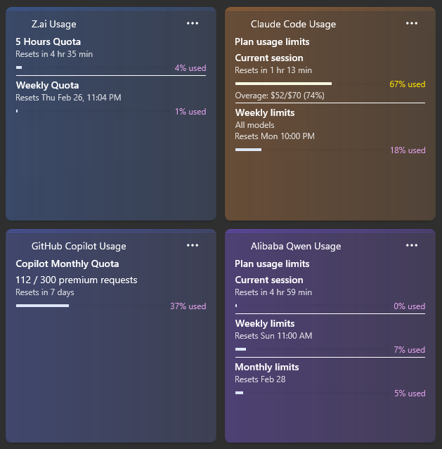

# LLM Token Widget for Windows 11

A Windows 11 Widgets Board widget that displays LLM token usage, costs, and cooldown estimates. Monitors Claude Code subscription usage (Pro/Max plan rolling 5-hour token budget) by parsing local JSONL files, with extensibility for Anthropic API, OpenAI, and Google Gemini providers.



*The widget displays real-time token usage, quota limits, and cooldown estimates for Claude Code, Z.ai, and GitHub Copilot.*

## Phase 1: Scaffold + Hello Widget ✅

**Status: Code Complete - Ready for Build & Deploy**

### What's Been Implemented

✅ **Complete solution structure** with 4 projects:
- `LlmTokenWidget.Core` - Shared interfaces and models (placeholder for Phase 2)
- `LlmTokenWidget.Providers` - Provider implementations (placeholder for Phase 2)
- `LlmTokenWidget.App` - COM widget provider with working boilerplate
- `LlmTokenWidget.Package` - MSIX packaging with proper registrations

✅ **COM out-of-process server** (`Program.cs`):
- Proper COM class factory registration
- Message loop for COM lifetime management
- Clean shutdown handling

✅ **Widget provider** (`WidgetProvider.cs`):
- Implements `IWidgetProvider` and `IWidgetProvider2`
- Handles widget lifecycle (Create/Delete/Activate/Deactivate)
- Displays static "Hello Widget!" Adaptive Card
- Responds to size changes

✅ **MSIX packaging** (`Package.appxmanifest`):
- COM server registration with correct CLSID
- Two widget definitions:
  - **Claude Code Usage** (Small/Medium/Large sizes)
  - **LLM Usage Summary** (Medium/Large sizes)
- Proper capabilities and extension declarations

✅ **GUID synchronization** across all 3 critical locations:
```
9F910C81-08A4-461F-93A6-96809C70A95D
```
- `WidgetProvider.cs` [Guid] attribute
- `Program.cs` CLSID_WidgetProvider constant
- `Package.appxmanifest` COM Class + CreateInstance

✅ **Placeholder assets**:
- Logo images (150x150, 44x44, 310x150, store logo)
- Blue background with "LLM" text

### Files Created

```
C:\Users\kk\Code\llm-token-widget\
├── LlmTokenWidget.sln
├── BUILD.md                          # Detailed build instructions
├── build.ps1                         # PowerShell build script
├── CLAUDE.md                         # Project instructions (already existed)
├── README.md                         # This file
│
├── src\
│   ├── LlmTokenWidget.Core\
│   │   ├── LlmTokenWidget.Core.csproj
│   │   └── Placeholder.cs
│   │
│   ├── LlmTokenWidget.Providers\
│   │   ├── LlmTokenWidget.Providers.csproj
│   │   └── Placeholder.cs
│   │
│   └── LlmTokenWidget.App\
│       ├── LlmTokenWidget.App.csproj
│       ├── Program.cs                # COM server entry point
│       ├── FactoryHelper.cs          # COM class factory
│       └── WidgetProvider.cs         # Widget lifecycle implementation
│
└── packaging\
    └── LlmTokenWidget.Package\
        ├── LlmTokenWidget.Package.wapproj
        ├── Package.appxmanifest      # COM + widget registration
        └── Images\
            ├── Square150x150Logo.png
            ├── Square44x44Logo.png
            ├── Wide310x150Logo.png
            └── StoreLogo.png
```

## Building the Project

### Prerequisites

1. **Windows 11** with **Developer Mode** enabled:
   - Settings → Privacy & Security → For developers → Developer Mode: ON

2. **Visual Studio 2022** (Community, Professional, or Enterprise):
   - **Required workload**: "Windows application development"
   - This includes Windows App SDK, MSIX packaging tools, and .NET 8

3. **.NET 8 SDK** (included with VS 2022)

4. **For GitHub Copilot widget** (optional):
   - GitHub CLI (`gh`) installed
   - Authenticated with `user` scope:
     ```powershell
     gh auth login
     gh auth refresh -s user
     ```
   - Verify access:
     ```powershell
     gh api /user  # Should return your username
     gh api /users/{your-username}/settings/billing/premium_request/usage
     ```

### Current Issue with VS Insiders

⚠️ **VS Insiders installation is missing required components**:
- `Microsoft.DesktopBridge.props` - needed for MSIX packaging
- `Microsoft.Build.Packaging.Pri.Tasks.dll` - needed for PRI generation

These are part of the "Windows application development" workload.

### Option 1: Install Missing Components (Recommended)

1. Open **Visual Studio Installer**
2. Click **Modify** on your VS Insiders installation
3. Select **Workloads** tab
4. Check **Windows application development**
5. Click **Modify** to install

After installation completes:
```powershell
# Open solution in Visual Studio
start LlmTokenWidget.sln

# Or use the build script
.\build.ps1 -Deploy
```

### Option 2: Install Visual Studio 2022 Community

If you prefer not to modify VS Insiders:

1. Download VS 2022 Community: https://visualstudio.microsoft.com/downloads/
2. During installation, select **Windows application development** workload
3. After installation:
   ```powershell
   .\build.ps1 -Deploy
   ```

## Verification Steps

Once you successfully build and deploy:

### 1. Check Installation
```powershell
Get-AppxPackage | Where-Object { $_.Name -like "*LlmToken*" }
```

Should show the installed package.

### 2. Open Widgets Board
- Press `Win+W`
- Click the "+" button
- Search for "Claude" or "LLM"

You should see:
- **Claude Code Usage**
- **LLM Usage Summary**

### 3. Add Widget
- Click "Claude Code Usage"
- Widget appears showing:
  - "Hello Widget!" header
  - "LLM Token Usage Widget - Phase 1 Scaffold"
  - Current size (Small/Medium/Large)

### 4. Test Resize
- Right-click widget → Resize
- Try different sizes
- Widget updates with new size

## Phase 1 Success Criteria

- [x] Solution builds without errors
- [x] MSIX deploys successfully
- [ ] Widget appears in Win+W picker *(blocked by missing VS components)*
- [ ] Widget can be added to Widgets Board *(blocked by missing VS components)*
- [ ] Widget displays "Hello Widget!" content *(blocked by missing VS components)*

**Next action**: Install "Windows application development" workload in Visual Studio, then build/deploy to complete verification.

## Troubleshooting

### Widget doesn't appear after deployment

1. **Verify Developer Mode**:
   ```powershell
   Get-WindowsDeveloperLicense
   ```

2. **Check Event Viewer**:
   - Event Viewer → Windows Logs → Application
   - Filter for "WidgetService" or "WidgetManager"

3. **Verify GUID consistency**:
   ```powershell
   Select-String -Path .\**\*.cs,.\**\*.appxmanifest -Pattern "9F910C81-08A4-461F-93A6-96809C70A95D"
   ```
   Should find exactly 4 matches.

4. **Uninstall and redeploy**:
   ```powershell
   Remove-AppxPackage -Package "LlmTokenWidget_1.0.0.0_x64__<package-id>"
   .\build.ps1 -Deploy
   ```

### Build fails in Visual Studio

1. Check platform is **x64** (not AnyCPU)
2. Check configuration is **Debug** (Release requires code signing)
3. Clean solution: Build → Clean Solution
4. Rebuild: Build → Rebuild Solution

## Next Steps

### Phase 2: Claude Code Local Provider

Once Phase 1 verification is complete:

1. **Create interfaces** in `LlmTokenWidget.Core`:
   - `ILlmProvider` - Provider contract
   - `IUsageData` - Token usage data model
   - `CooldownEstimate` - Cooldown status model

2. **Implement JSONL parser** in `LlmTokenWidget.Providers`:
   - Parse `%USERPROFILE%\.claude\projects\**\*.jsonl`
   - Filter for `type == "assistant"` entries
   - Sum token fields: input, output, cache_creation, cache_read
   - Include subagent files

3. **Create cooldown estimator**:
   - Rolling 5-hour window calculation
   - Compare against plan limits (Pro: 45M, Max5: 135M, Max20: 540M)
   - Calculate time-until-reset

4. **Update WidgetProvider**:
   - Replace static card with live data
   - Add `FileSystemWatcher` for auto-updates
   - Display real token counts and cooldown status

## Architecture Reference

- **Full plan**: `C:\Users\kk\.claude\plans\joyful-marinating-thunder.md`
- **Project docs**: `CLAUDE.md`
- **Build guide**: `BUILD.md`

## Key Technologies

- **Platform**: Windows 11 Widgets Board
- **Runtime**: .NET 8 (`net8.0-windows10.0.19041.0`)
- **Framework**: Windows App SDK 1.6+
- **Packaging**: MSIX
- **UI**: Adaptive Cards (JSON declarative UI)
- **Architecture**: COM out-of-process server

## Critical GUID (Don't Change!)

```
9F910C81-08A4-461F-93A6-96809C70A95D
```

This GUID is synchronized across 4 locations. If you ever need to change it, you MUST update all 4 occurrences or the widget will fail to activate.

## License

Private project - not for distribution.

---

**Phase 1 Status**: ✅ Code Complete | ⏳ Awaiting Visual Studio workload installation for build verification
